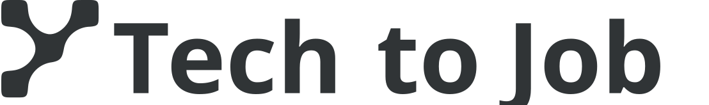
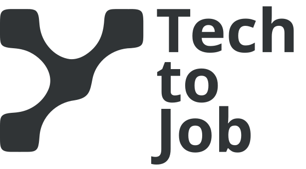

<div align="center">
  <picture>
    <source media="(prefers-color-scheme: dark)" srcset="public/brand/horizontal-negative.svg">
    <source media="(prefers-color-scheme: light)" srcset="public/brand/horizontal-positive.svg">
    
  </picture>
</div>

# TechToJob · Torneo #2

Landing oficial de TechToJob para el Torneo #2 de desarrollo web. TechToJob es una
comunidad donde desarrolladores y empresas participan, construyen y se conocen.
La landing presenta esa propuesta y guía a los visitantes hacia Discord, sin
prometer empleo.

**[Ver sitio en vivo](https://techtojob.vercel.app/)**

## Qué incluye

La landing está implementada y aprobada desde Header hasta Footer:

Header · Hero · Cómo funciona · Talento · Empresas · Torneos · Networking ·
Testimonios · Noticias · Newsletter · CTA final · Footer.

Incluye navegación entre secciones, una página de aviso legal provisional, metadata,
datos estructurados, imágenes sociales y favicon adaptativo. Noticias enlaza a
publicaciones de LinkedIn con fechas verificadas y elementos semánticos `time`.
La Newsletter está deshabilitada; las limitaciones de la versión del torneo se
detallan más abajo.

Las decisiones visuales y el estado de las secciones están en
[docs/DESIGN.md](docs/DESIGN.md); el copy aprobado y sus destinos, en
[docs/CONTENT.md](docs/CONTENT.md).

## Tecnología y arquitectura

- Next.js 16 App Router y TypeScript, con Server Components y renderizado estático.
- Tailwind CSS 4 y CSS Modules para composiciones específicas de cada sección.
- Sora mediante `next/font/google`.
- GSAP e IntersectionObserver para mejoras decorativas localizadas; MobileMenu
  añade cierre, animación y gestión de foco al menú nativo.

```text
src/app/                 # Páginas, layout, estilos globales y rutas SEO
src/components/layout/   # Header, MobileMenu y Footer
src/components/sections/ # Secciones de la landing y motion localizado
src/config/              # Configuración central del sitio
src/lib/                 # Renderizado compartido de imágenes sociales
messages/                # Contenido en español
public/brand/            # SVG oficiales de marca
public/social/           # Artwork de la imagen social
docs/                    # Dirección visual y copy aprobados
```

El idioma actual es español (`lang="es"`). El copy visible y SEO está centralizado
en [messages/es.json](messages/es.json). Los namespaces preparan una futura
internacionalización, pero no hay otros locales ni `next-intl` implementados.
La navegación usa anchors nativos dentro de la homepage y `Link` para llegar a sus
secciones desde el aviso legal.

## Desarrollo local

Requisitos: **Bun 1.3.14 o superior** y **Node.js 20.9 o superior**.

```sh
bun install
bun run dev
```

Abrir <http://localhost:3000>. Para validar y después servir el build de producción:

```sh
bun run check
bun run start
```

`check` ejecuta en orden `bun run lint`, `bun run typecheck` (`tsc --noEmit`) y
`bun run build`. También pueden ejecutarse por separado. El build necesita acceso
a Google Fonts para obtener Sora; después Next.js la sirve localmente con los pesos
400, 600 y 700 y `display: swap`.

### Entorno y SITE_URL

Copiar [.env.example](.env.example) a `.env.local` para configurar el entorno local.
En hosting, definir `SITE_URL` **antes del build de producción**. El despliegue
actual en Vercel utiliza:

```dotenv
SITE_URL=https://techtojob.vercel.app/
```

Debe ser un origen público HTTP(S), sin credenciales, subrutas, query ni fragmentos.
Los valores inválidos fallan en la validación. Volver a ejecutar el build si cambia
el valor; [src/config/site.ts](src/config/site.ts) es la única fuente de verdad.

| Configuración          | Comportamiento SEO                                                                                                                                    |
| ---------------------- | ----------------------------------------------------------------------------------------------------------------------------------------------------- |
| `SITE_URL` vacío       | `noindex, nofollow`; robots impide el rastreo; sitemap vacío; se omiten canonical y URLs públicas de las imágenes sociales; JSON-LD omite URL y logo. |
| `SITE_URL` configurado | `index, follow` en la homepage; canonical y sitemap de la homepage; URLs absolutas para Open Graph, Twitter y Organization.                           |

Dejarlo vacío en previews que no deban indexarse. El aviso legal mantiene `noindex`
incluso con el origen configurado. Para otro despliegue, instalar con Bun y ejecutar
`bun run build`; un host con Node.js puede servirlo con `bun run start`.

## Diseño, marca y licencias

Sora, charcoal `#2f3436`, mint `#84c0bf` y blanco `#ffffff` definen la identidad.
La dirección editorial-tech utiliza tipografía, espacio en blanco y geometría,
con composiciones adaptadas a desktop, tablet y mobile. La landing no utiliza
fotografías de stock externas; las composiciones decorativas en SVG y CSS forman
parte de esta implementación.

Los assets oficiales de TechToJob fueron suministrados para el torneo.
[public/brand/](public/brand/) contiene doce SVG: símbolo, logo horizontal y logo
apilado, cada uno en variantes black, gradient, negative y positive. Los SVG
corregidos actuales no contienen texto editable ni dependen de una fuente externa.
El logo apilado con gradiente incluye datos raster embebidos.

Este README usa los logos horizontales oficiales negativo en modo oscuro y positivo
en modo claro, con fallback positivo. Sus letras son trazados vectoriales: no
necesitan el CSS de Sora del sitio ni exports PNG para mostrarse de forma independiente.
Header y Footer incorporan el logo oficial inline; Footer distingue su ID raíz.
No se afirman derechos adicionales de licencia o redistribución sobre la marca.

Los favicons SVG adaptativos usan `symbol-positive.svg` (charcoal) para UI clara y
`symbol-negative.svg` (mint) para UI oscura, según el tema del navegador. No hay un
selector de tema en el sitio. [src/app/favicon.ico](src/app/favicon.ico) aporta el
fallback de compatibilidad de App Router: tamaños de 16, 32 y 48 px con transparencia,
rasterizados desde el símbolo positivo oficial sin modificar el SVG original.
Next.js añade su enlace antes de los dos SVG adaptativos.

### Iconos sociales

Los paths del Footer se copiaron exactamente del repositorio oficial de
[Simple Icons](https://github.com/simple-icons/simple-icons):

- Discord, X e Instagram: revisión [b86d5c9](https://github.com/simple-icons/simple-icons/tree/b86d5c9a0bdd4f3f5c30898a63654dd32f39fd76/icons).
- LinkedIn: [SVG 13.21.0](https://github.com/simple-icons/simple-icons/blob/13.21.0/icons/linkedin.svg), fuente histórica oficial verificada; no está presente en las versiones actuales ni se reconstruyó su path.

Se verificaron la [licencia CC0-1.0 del proyecto](https://github.com/simple-icons/simple-icons/blob/b86d5c9a0bdd4f3f5c30898a63654dd32f39fd76/LICENSE.md), su [disclaimer](https://github.com/simple-icons/simple-icons/blob/b86d5c9a0bdd4f3f5c30898a63654dd32f39fd76/DISCLAIMER.md) y la licencia de la versión archivada. CC0 en Simple Icons no implica que cada icono de marca sea CC0 ni concede derechos sobre marcas registradas; siguen aplicándose los términos individuales de cada marca. Los paths se almacenan localmente, sin dependencia de paquete ni solicitudes de iconos en runtime.

## Accesibilidad, SEO y rendimiento

La implementación utiliza landmarks semánticos, un único H1 por página, jerarquía
de títulos, enlaces reales, foco visible y labels de formulario. Ambas páginas
incluyen un skip link; los iconos sociales tienen nombres accesibles y áreas de
44 px. Los gráficos decorativos están ocultos para las tecnologías de asistencia.

El menú mobile conserva `details`/`summary` nativos y funciona sin JavaScript,
con cierre manual. Con JavaScript, los clicks ordinarios cierran el menú y enfocan
el destino local; Escape devuelve el foco al control. Los clicks modificados
conservan su acción nativa. El Header sticky y el scroll padding permiten navegar
por anchors sin ocultar el destino; el scroll suave respeta reduced motion.

El contenido permanece estático. GSAP y pequeños helpers con IntersectionObserver
animan el arte decorativo una vez, sin ScrollTrigger, scroll scrubbing ni estado
React por frame. Sin JavaScript o con reduced motion se conserva el estado visual
final; el menú omite su animación con reduced motion. Next.js aporta el runtime
cliente estándar. Las comprobaciones responsive del proyecto cubren 1440, 1366,
1280, 1024, 900, 820, 768, 430, 390 y 375 px.

### Metadata e imágenes sociales

Title y description en español utilizan la Metadata API. Canonical, robots,
sitemap, Open Graph y Twitter derivan sus URLs públicas de `SITE_URL`, sin fallback
a localhost. La homepage incluye Organization JSON-LD escapado con el nombre y
perfiles sociales confirmados y, cuando hay origen configurado, la URL y el logo.
Las páginas secundarias usan la plantilla de título `%s | TechToJob`;
`/aviso-legal` tiene canonical propio cuando se configura el origen y `noindex, follow`.

[/opengraph-image](https://techtojob.vercel.app/opengraph-image) y
[/twitter-image](https://techtojob.vercel.app/twitter-image) devuelven PNG
prerenderizados de **1200 × 630** mediante
[ImageResponse](https://nextjs.org/docs/app/api-reference/functions/image-response).
El renderer compartido [src/lib/social-image.tsx](src/lib/social-image.tsx) lee el
artwork oficial existente [public/social/techtojob-og.png](public/social/techtojob-og.png)
desde el filesystem como data URL/base64 y cubre el canvas con `objectFit: "cover"`.
El original se conserva sin modificaciones y no se solicitan assets externos en runtime.

### Lighthouse en producción

Resultados de la versión final desplegada, verificados y proporcionados por el autor:

| Modo                                 | Performance | Accessibility | Best Practices | SEO |
| ------------------------------------ | ----------- | ------------- | -------------- | --- |
| Mobile — mediana de tres ejecuciones | **98**      | 100           | 100            | 100 |
| Desktop                              | **100**     | 100           | 100            | 100 |

Performance mobile registró **89, 98 y 98**; Accessibility, Best Practices y SEO
fueron 100 en las tres ejecuciones. Son mediciones puntuales de Lighthouse sobre
el despliegue, no datos continuos de usuarios reales ni una garantía de resultados
futuros. La captura y conservación de las evidencias para la entrega siguen pendientes.

## Limitaciones actuales

- **Newsletter:** deshabilitada; no recoge suscripciones ni tiene proveedor o
  endpoint. El formulario conserva label, autocomplete y un aviso visible de
  disponibilidad; el submit está deshabilitado y Enter no envía ni recarga la página.
  El copy describe una propuesta semanal, pero no se simula una suscripción ni un
  estado de éxito. La integración queda para una futura versión operativa.
- **Testimonios:** placeholders permitidos por el brief del torneo. Antes del uso
  operativo deben sustituirse por testimonios verificados, fotografías y enlaces
  a perfiles de la comunidad.
- **Aviso legal:** documentación provisional de la implementación del torneo,
  inadecuada como aviso legal operativo definitivo. Debe sustituirse por el texto
  oficial de TechToJob antes de su uso operativo.

## Uso de IA

Se utilizaron y declararon herramientas de IA según las reglas del torneo.
ChatGPT y Codex ayudaron en planificación, iteración de copy, implementación,
refinamiento y revisión técnica. Claude (Anthropic) y Gemini (Google) también
participaron en propuestas de dirección artística, prototipos visuales y revisión
independiente. Las decisiones finales de diseño e implementación fueron
seleccionadas, revisadas y validadas por el autor, quien puede explicar y defender
el trabajo.

## Estado de entrega

El repositorio es público y la versión final está desplegada en Vercel con
`SITE_URL` configurado. El autor verificó el sitio de producción.

- [x] Repositorio público.
- [x] Versión final desplegada y verificada en <https://techtojob.vercel.app/>.
- [x] Lighthouse ejecutado sobre el sitio desplegado.
- [ ] Confirmar la revisión final enviada al torneo.
- [x] Tomar manualmente las capturas finales de desktop y mobile.
- [x] Capturar y guardar las evidencias de Lighthouse requeridas.
- [ ] Enviar repositorio, deployment y evidencias requeridas en Discord.

En futuras releases, volver a verificar canonical, robots, sitemap, datos
estructurados y ambas rutas de imágenes sociales en el origen público.

---

<div align="center">
  <picture>
    <source media="(prefers-color-scheme: dark)" srcset="public/brand/stacked-negative.svg">
    <source media="(prefers-color-scheme: light)" srcset="public/brand/stacked-positive.svg">
    
  </picture>
</div>
